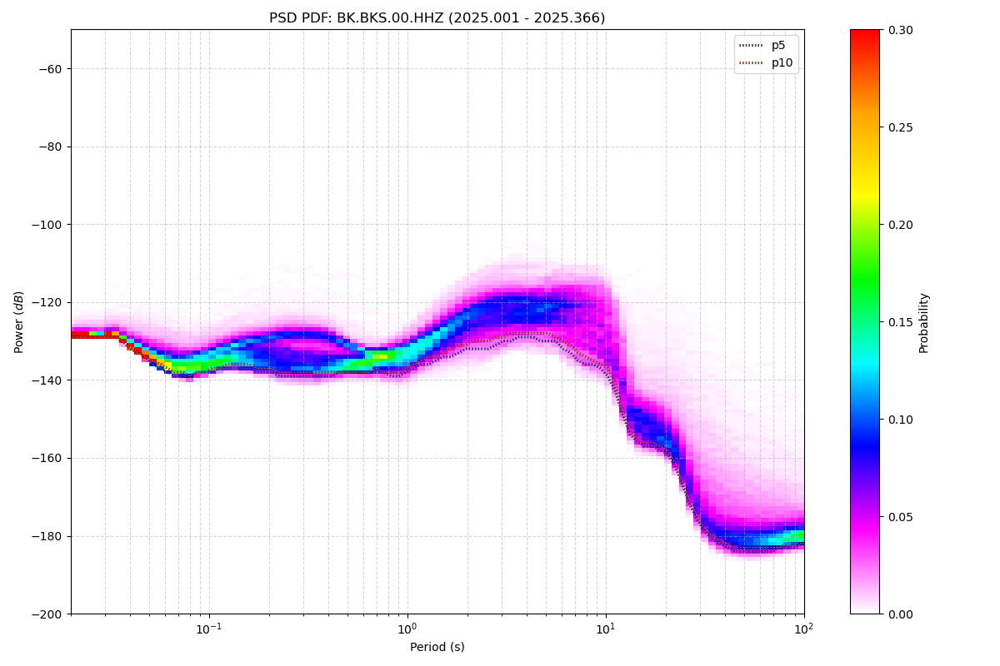
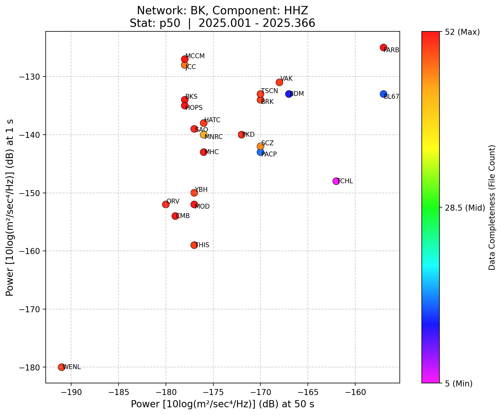

# Seismology Probability & PSD Analysis

[](https://www.python.org/downloads/)
[](https://opensource.org/licenses/MIT)

A high-performance data pipeline for processing, profiling, and visualizing seismic network noise data.

**Seismology Probability & PSD Analysis** quantifies seismic station noise levels across multiple structural periods using raw PDF data, generating detailed Probability Density Function (PDF) heatmaps and cross-network Power Spectral Density (PSD) scatter plots. Built initially for the Berkeley Seismology Lab (BSL) but architected with flexibility in mind to analyze any dynamically structured `PDFanalysis` datasets.

---

## Key Capabilities

- **PDF Heatmap Synthesis**: Aggregates massively distributed daily PSD files to compute high-fidelity structural noise percentile curves (e.g., p5, p50, p95).
- **Network-Wide Comparison**: Generates interactive scatter plots to cleanly compare aggregated multi-period PSD statistics.
- **Dynamic Site Discovery**: Automatically scrapes and cross-references active channel statuses and underlying metadata.
- **Outlier Diagnostics**: Quickly zero in on anomalous stations, faulty sensors, or local noise sources leveraging strict statistical thresholds.

---

## Architecture

The pipeline consists of two primary decoupled components:

1. **Probability Engine (`probability/main.py`)**: 
   - A standalone processing core that parses raw datasets, recursively computes probabilities over thousands of daily files, and exports aggregated percentile arrays (`.csv`) alongside visual heatmaps (`.png`).
2. **Scatter Plot Analyzer (`main.py`)**: 
   - The primary orchestrator. Consumes YAML specifications, drives active channel discovery, queries the Probability Engine, and aggregates scatter visualization to compare localized instrument components.

<details>
<summary><b>View Directory Structure</b></summary>

```text
psd/
├── main.py                  # PSD plotter orchestrator
├── config.yml               # Scatter configurations
├── channel_builder.py       # Active station discovery
├── probability/             # Probability Engine
│   ├── main.py              # Engine CLI
│   ├── processing.py        # PDF Aggregation logic
│   └── ...
└── psd_summ_results/        # Rendered analysis outputs 
```
</details>

---

## Installation

```bash
git clone https://github.com/matthew-ju/seismology-probability-analysis.git
cd seismology-probability-analysis
pip install -r requirements.txt
```

*Prerequisite: Python 3.10+ and configured networking access to standardized `PDFanalysis.*.pdf` directory structures.*

---

## Usage Example & Interactive Demo

### 1. The Probability Engine Core

Generate exact period-power percentiles and heatmap visualizations for an individual station:

```bash
cd probability/
python3 main.py --stations BKS --components HHZ HHN HHE --start-year 2025 --end-year 2025
```

**Heatmap Output** (Probability Distribution with over-plotted noise percentiles):


*(Output includes a robust `.csv` numerically mapping `period_log10` to requested interval percentiles)*

### 2. Network-Wide PSD Analyzer

Utilizing the YAML configuration (`config.yml`), simply run the orchestrator:

```bash
python3 main.py config.yml
```

This runs the full operational flow, outputting both interactive network-wide HTML graphs and comprehensive Excel matrix reports.

**Scatter Plot Output** (BK Network HHZ, 50s vs 1s noise comparison):


*(Stations clustered tightly have identical noise specifications; scattered outliers represent unique or anomalous behaviors)*

### 3. Interactive Visualization

Network-wide outputs from the Scatter Plot Analyzer feature interactive diagnostic capabilities. Watch the demo below to see dynamic exploration of outliers and sensor metadata natively in the browser:

https://github.com/matthew-ju/seismology-probability-analysis/raw/main/interactive_vis_demo.mp4

---

## Configuration Snippet (`config.yml`)

The analyzer focuses heavily on usability, simplicity, and reproducibility:

```yaml
base_dir: "/ref/dc14/PDF/STATS"
network: ["BK", "NC"]
components: ["HHZ", "HHN", "HHE", "EHZ", "EHN", "EHE"]

period_x: 50       # Target Compare Period (x-axis)
period_y: 1        # Target Compare Period (y-axis)
stat: "p50"        # Aggregate statistic (e.g. median)

# Active Time Constraints
start_year: 2024
end_year: 2025
```

---

*Note: Monolithic legacy architectures (`psd.py` and `probability/probability.py`) are archived for tracking operational history within their respective directories.*
